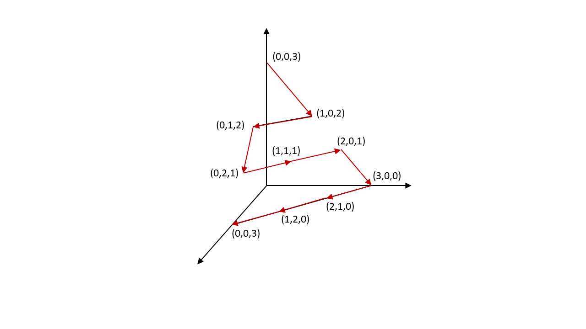

# PrologAssistant

This is a free-time passion project to practice my software developement skills.
Features:
- Custom reasoner
- Simple parsing
- Made in maven
- Comprehensive tests
- Command-line interface
- Entirely self-developed algorithms for many different topics

## Algorithms: Best of

### The List-unification domain system
I came up with this system all by myself! It can unify complex lists consisting of both Variables and other Terms.

#### 1: Generating all possible segmentations of a List consisting of n variables

Let us assume two lists `[X,Y,Z]` and `[dog,cat,mouse]` or more general: One list of Variables and one of fixed terms.
The possible unifications are:
```
true: {X=, Y=, Z=[dog[cat[mouse]]]}
true: {X=, Y=dog, Z=[cat[mouse]]}
true: {X=, Y=[dog[cat]], Z=mouse}
true: {X=, Y=[dog[cat[mouse]]], Z=}
true: {X=dog, Y=, Z=[cat[mouse]]}
true: {X=dog, Y=cat, Z=mouse}
true: {X=dog, Y=[cat[mouse]], Z=}
true: {X=[dog[cat]], Y=, Z=mouse}
true: {X=[dog[cat]], Y=mouse, Z=}
true: {X=[dog[cat[mouse]]], Y=, Z=}
```
And guess what! Those are all outputs by my program!

So how is this done? Be doing recursion across the dimensions:
In a 2-dimensional case, generating all the different segmentations is easy:
You have the length of the list with fixed terms. Then all solutions are just the diffent combinations, so that `len(list of terms) = len(var A) + len(var(B))`

You can now do the following recursion from 3 to two dimensions (3-dimensions being the above example):

As you can see, all  the length sums equal 3, which fits the above example.
By "fixing" one of the values, the 3-dimensional problem turns into 3 2-dimensional problems. In the first one, we fix 
the 3rd dimension as "3" - Leaving a two-dimensional problem with 2 variables and a target length of 0. This trivially has
only one solution - Zero and Zero. This gives the topmost coordinate of (0,0,3).
We then decrement the 3rd dimension and get another 2-dimensional problem with 2 solutions and so on.

For all other dimensions this inductively works the same, eventually boiling down to many 2-dimensional problems.

#### 2: Splitting the variables into "domains"

Let's look at these 2 lists `[X,Y,Z,flower,V]` and `[dog,cat,mouse,flower,salad]`
This has complicated the issue. If we want to unify these lists, the first 3 are basically the same as our above problem.
The last list element is also easy with the unifier `V=salad`
By iterating over the list and finding all common elements and creating "variable domains" for the segments of variables we can 
again reduce the problem into many smaller problems. **Divide and conquer!**

#### 3: Creating unficiation clauses
To actually use a unification algorithm these domains and so on have to become a list of unification clauses.
The domains are interpreted as iterators over lists of unification clauses. When they are done they try to find other Variable 
domains to create new combinations of clauses. When none can be found, the reasoner terminates.

## Syntax

To make regex-parsing possible, the traditional prolog syntax has been changed:

### Atoms
Atoms are any lowercase word such as `dog,cat,house`

### Variables
Variables are any upper case word such as  `SALAD,X,Y`
A special type of variable is dont-care, written as `_`

### Relations
Relations are somewhat like atoms, but with a list of different terms
Relations usually look like `related(dog,cat,bird,automobile)`

### Lists
Lists are writte like this: `[term1.terms(dog,cat,mouse).last]`
Note that a punctuation mark is used instead of a comma to ease parsing

## Example uses

```
:l
>Please enter filename (relative to running program):
test.txt
>member([B[[_[B[_]]]]]), known([markus[einkaufen]]),
    pattern([I[Y]]):-[member([N[I]]), known([N[Y]])], 
?pattern([where.is.markus],OUTPUT)
>true: {B=N, OUTPUT=einkaufen, Y=OUTPUT, I=[where[is[markus]]], N=markus, _=[where[is]]}
;
>false
```

As you can see the returned unifier is not a most general unifier, but that will have to be fixed some other day

## Tests code

Passing tests look so satisfying, so here are some!

```
[INFO] -------------------------------------------------------
[INFO]  T E S T S
[INFO] -------------------------------------------------------
[INFO] Running Prolog.PListTest
[INFO] Tests run: 6, Failures: 0, Errors: 0, Skipped: 0, Time elapsed: 0.023 s - in Prolog.PListTest
[INFO] Running Prolog.PrologEnvTest
[INFO] Tests run: 1, Failures: 0, Errors: 0, Skipped: 0, Time elapsed: 0 s - in Prolog.PrologEnvTest
[INFO] Running Prolog.QueryTest
[INFO] Tests run: 9, Failures: 0, Errors: 0, Skipped: 0, Time elapsed: 0.016 s - in Prolog.QueryTest
[INFO] Running Prolog.RuleTest
[INFO] Tests run: 4, Failures: 0, Errors: 0, Skipped: 0, Time elapsed: 0 s - in Prolog.RuleTest
[INFO] Running Prolog.TermTest
[INFO] Tests run: 6, Failures: 0, Errors: 0, Skipped: 0, Time elapsed: 0.004 s - in Prolog.TermTest
[INFO] Running Prolog.Unification.UnificationClauses.ListReexecution.ListReexecutionTest
[INFO] Tests run: 3, Failures: 0, Errors: 0, Skipped: 0, Time elapsed: 0 s - in Prolog.Unification.UnificationClauses.ListReexecution.ListReexecutionTest
[INFO] Running Prolog.Unification.UnificationClauses.ListReexecution.SolutionFinderTest
[INFO] Tests run: 3, Failures: 0, Errors: 0, Skipped: 0, Time elapsed: 0 s - in Prolog.Unification.UnificationClauses.ListReexecution.SolutionFinderTest
[INFO] Running Prolog.Unification.UnifierTest
[INFO] Tests run: 10, Failures: 0, Errors: 0, Skipped: 0, Time elapsed: 0.012 s - in Prolog.Unification.UnifierTest
[INFO] 
```


